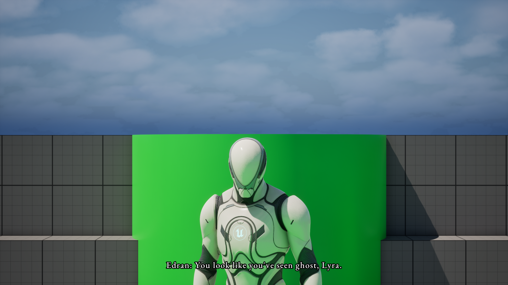

  

A demo project for [Chronicle](https://github.com/janikowski-dev/Chronicle) - an Unreal Engine plugin for building narrative-driven games. It gives developers a visual way to create branching dialogues, hook up game logic through a rule system, manage characters, and cinematic timelines - all from within the editor.

## Demo

## Setup Presentation

Detailed explaination on how to set up a project coming soon!
